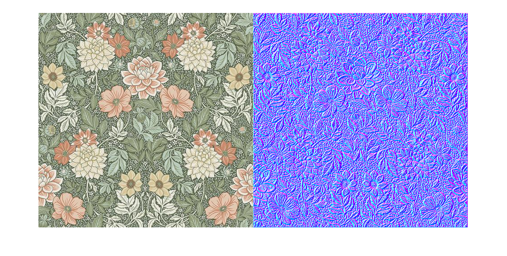

# NormalFromTexture
C script for generating a normal map from any given texture. 
The code is written in Matlab and converted to C using Matlab Coder.
The original matlab script is normalFromTexture.m, and the generated C code can be found under codegen/lib/normalFromTexture/

Example images are images of wallpapers taken from BoråsTapeters website: <https://www.borastapeter.com/>

